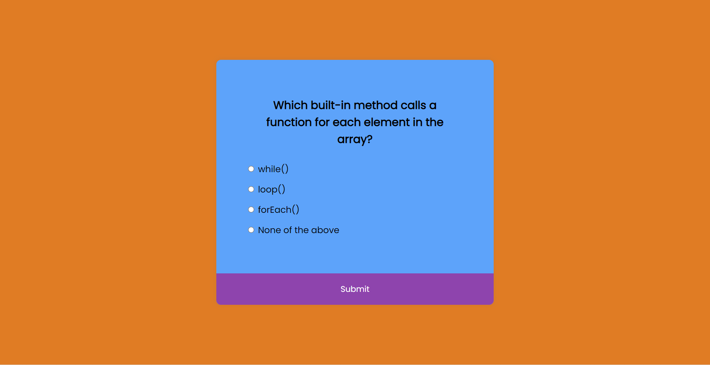
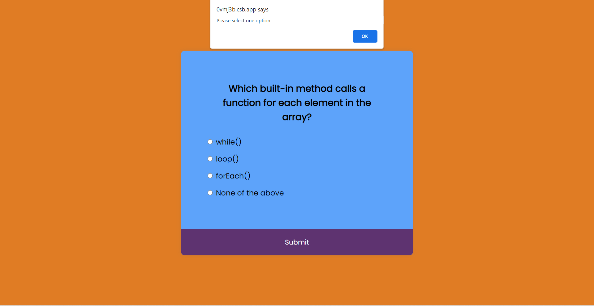
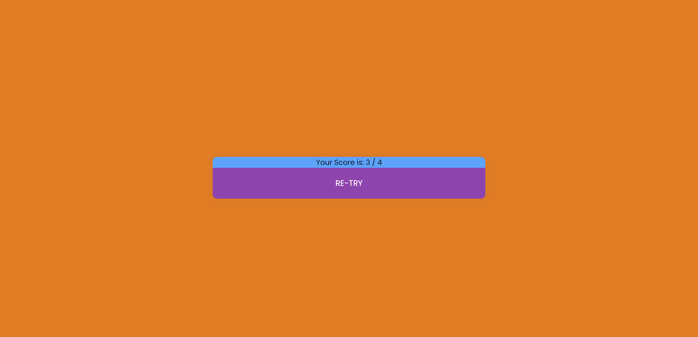

# JavaScript Project - JavaScript Quiz App

## **Project: A Simple Quiz App**

### Concepts learned from this project:
- Learned about generating quiz questions and validating quiz with answers and returning score.
- Learned about reloading page with alert if user doesn't select any option in a page.
- Learned about clearing radio buttons from selected to unselect after each quiz. Enjoyed while creating this project.

**Live Link :** [Deployed Link](https://js-project-quizapp.netlify.app/)
>### Preview :

